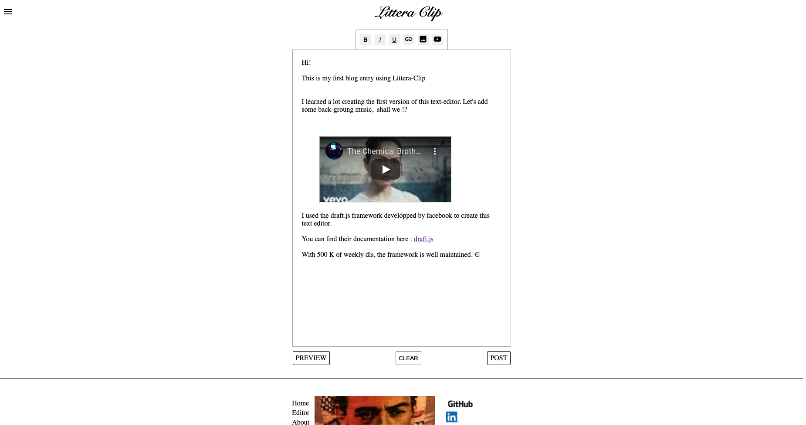

# Littera-Clip

Littera-Clipv1 was created using the draft.js framework from facebook.
It is a text-editor meant to create content that you can share.
The app is strictly FE for now, but futur iterations will include a BE to publish/save content and more editing options.



## Motivation

-'Why make a text-editor to post content Leonard ? There's plenty of better options out there...'
-'Oh you were finished ? Allow me to retort!'
Marsellus Wallace quote end -
The idea behind this project was to fill a gap between my previous career as a screenwriter and this new journey as a web dev I set my path on... so code a text-editor of my own that will allow for content publication! As a newb dev, it was fun to translate everything into functional components. That furthered my comprehension of React (Because all documentation is with class components).

## How it works

'Draft.js is a framework for building rich text editors in React, powered by an immutable model and abstracting over cross-browser differences.

Draft.js allows you to build any type of rich text input, whether you're only looking to support a few inline text styles or building a complex text editor for composing long-form articles.

Draft.js was introduced at React.js Conf in February 2016.'

I recommend watching this very interesting introduction:
[https://www.youtube.com/watch?v=feUYwoLhE_4&feature=emb_title&ab_channel=FacebookDevelopers]

## Installation

```bash
yarn install

```

##FAQ

Is Littera-Clip mobile friendly ?

Although meant for desktop use first, it is possible to use it on mobile devices. As per the draft.js documentation, the framework is not yet fully supported on mobile, but the architects behind it are working torwards making that a reality.

Can I contribute to this project ?

Of course.
